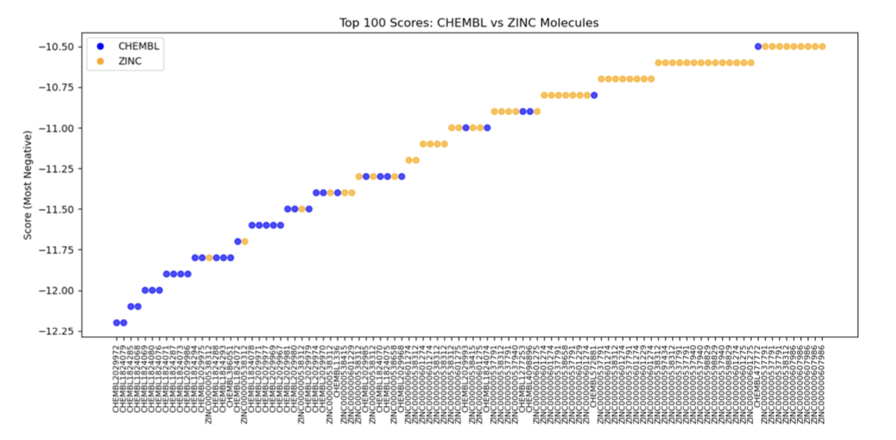
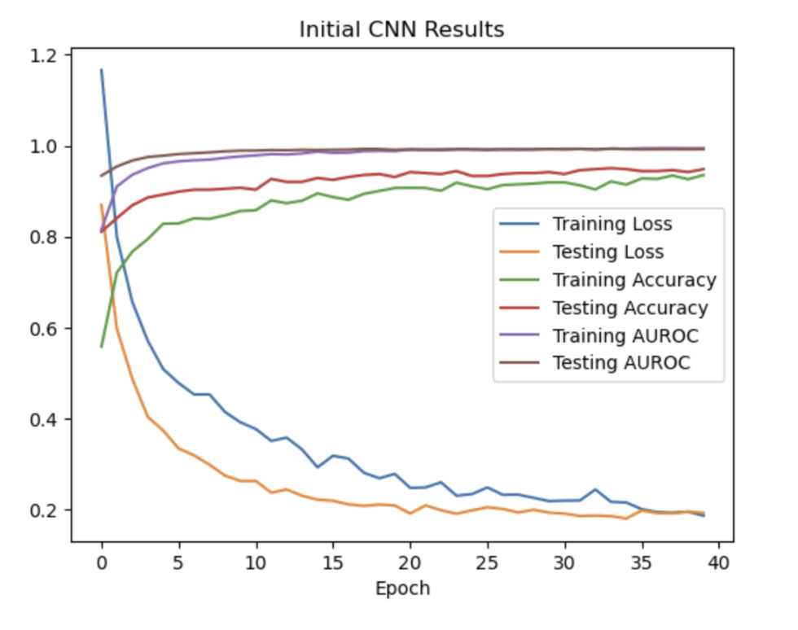

# braf-v600e-inhibitor-discovery
Computational drug discovery pipeline combining molecular docking, UMAP/KMeans clustering, and CNN classification to identify BRAF V600E inhibitors. Course project + independent research, Rohs Lab.


# BRAF V600E Inhibitor Discovery Pipeline
**Rohs Lab / QBIO 460 | USC, 2024**

## Overview
This project builds a computational drug discovery pipeline to identify 
potential inhibitors of the BRAF V600E oncogenic mutation — a key driver 
in melanoma, thyroid, colorectal, and ovarian cancers. The pipeline 
integrates molecular docking, dimensionality reduction, clustering, and 
deep learning to screen and classify candidate molecules across three 
distinct BRAF V600E conformations.

This work began as independent research in the Rohs Lab and was further 
developed as a final project for QBIO 460 (Intro to Machine Learning in 
Biology).

---

## Background
The BRAF V600E mutation replaces valine with glutamate at position 600, 
causing BRAF to become constitutively active as a monomer and driving 
unregulated cell growth. Current FDA-approved inhibitors (Vemurafenib, 
Dabrafenib, Encorafenib) are effective but limited by resistance mechanisms 
including RAF dimerization. This pipeline explores all three BRAF V600E 
conformations (PDB: 6p7g, 4xv2, 4e26) to more comprehensively identify 
candidate inhibitors.

---

## Pipeline
**1. Molecular Docking**  
AutoDock QVina simulated binding affinities for ChEMBL and ZINC molecules 
against all three BRAF V600E conformations. PDB structures were cleaned 
and missing residues modeled using MODELLER.

**2. Dimensionality Reduction & Clustering**  
Morgan fingerprints (2048-bit) were generated using RDKit. UMAP reduced 
the high-dimensional fingerprint space to 2D, and KMeans clustering 
grouped molecules by structural similarity. Optimal UMAP parameters were 
selected via silhouette score.

**3. CNN Classification**  
A 1D convolutional neural network classified molecules into four classes: 
non-binders, and binders for each of the three conformations. 
Hyperparameters (filter size, number of filters, batch size, dense layer 
size) were systematically tuned. Final model achieved testing AUROC > 0.9.

**4. ZINC Screening**  
The trained CNN was applied to ZINC database molecules with docking scores, 
identifying 27 candidate compounds predicted to bind the alpha-C helix 
in/DFG out conformation (6p7g). Top hit: ZINC000000001547, binding 
affinity -9.4 kcal/mol, Class 1 probability 0.86.

---

## Key Results


*Figure 1. Top 100 docking scores comparing known ChEMBL binders (blue) 
vs. random ZINC molecules (yellow). ChEMBL molecules dominate the top 
ranks despite being outnumbered 20-to-1, validating the docking pipeline.*


*Figure 2. CNN training curves showing testing accuracy and AUROC both 
stabilizing above 0.9 after ~20 epochs.*

**Top candidate compounds** from ZINC screening are available in 
`output.csv`, including ZINC IDs, binding affinities, and CNN class 
probabilities.

---

## Experimental Extension
`vae.ipynb` contains an exploratory implementation of a Variational 
Autoencoder (VAE) trained on molecular fingerprints. As noted in the 
paper's conclusion, a VAE could be used to generate novel molecular 
fingerprints for unexplored chemical spaces, potentially augmenting the 
training dataset and improving CNN performance. This component was not 
fully completed.

---

## Limitations
- CNN loss plateaued around 0.2; further regularization tuning is needed 
  to improve without overfitting
- Screening was focused on the 6p7g conformation; cross-conformation 
  comparison of CNN predictions remains as future work
- Molecular fingerprints may not be the optimal spatial representation 
  for CNN input; alternative vectorized representations could improve 
  performance

---

## Tools & Libraries
Python, RDKit, TensorFlow/Keras, scikit-learn, UMAP, pandas, numpy, 
matplotlib, seaborn, AutoDock QVina, MODELLER

## Data Sources
- ChEMBL BRAF V600E inhibitor dataset
- ZINC database (DBAP subset)
- PDB structures: 6p7g, 4xv2, 4e26

## Repository Contents
```
├── final_460.ipynb       # Full pipeline: docking → clustering → CNN → screening
├── vae.ipynb             # Experimental VAE extension
├── output.csv            # 27 candidate ZINC compounds with CNN predictions
├── docking_scores.csv    # Raw ZINC docking results
├── paper.pdf             # Full project writeup
└── figures/              # Key result figures
```

---

*This project was conducted in the Rohs Lab at USC and developed further 
as a final project for QBIO 460.*